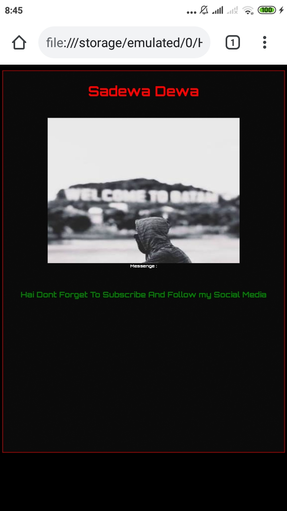
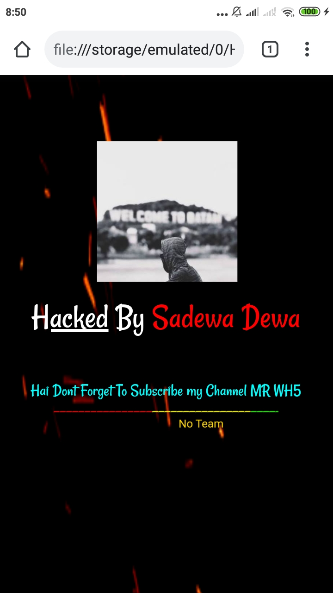
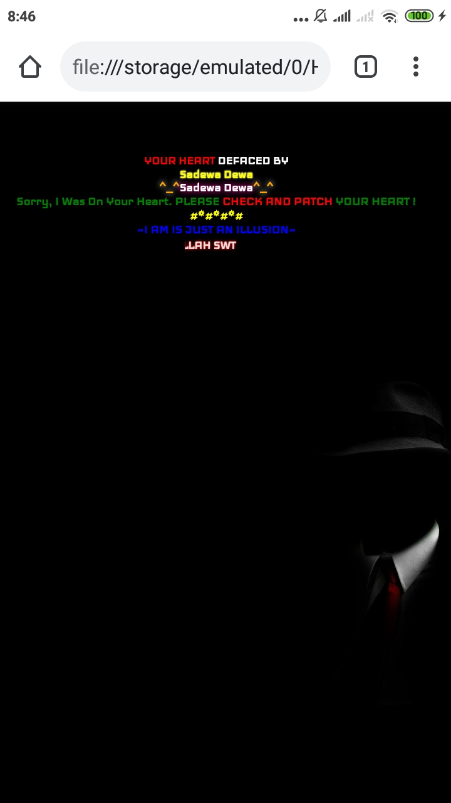
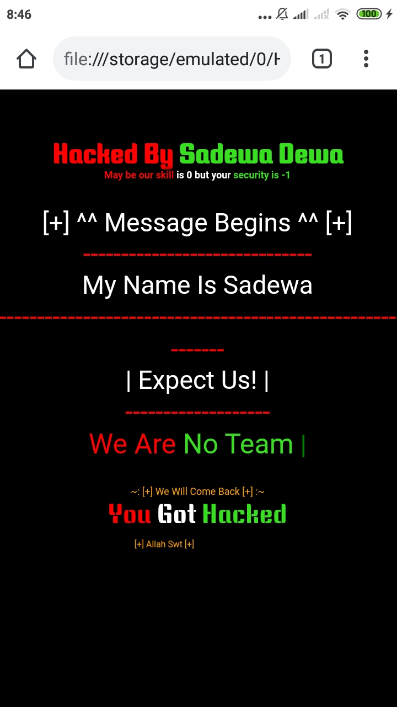

# SCDc
Script Deface Creator By Sadewa

# 𝕾𝖈𝖗𝖊𝖆𝖓 𝕾𝖍𝖔𝖔𝖙
Script V1 :
<p align="center">
    
</p>

Script V2 :
<p align="center">
    
</p>

Script V3 :
<p align="center">
    
</p>

Script V4 :
<p align="center">
    
</p>

# Run Script
```sh
python CreateSC.py
 ```
